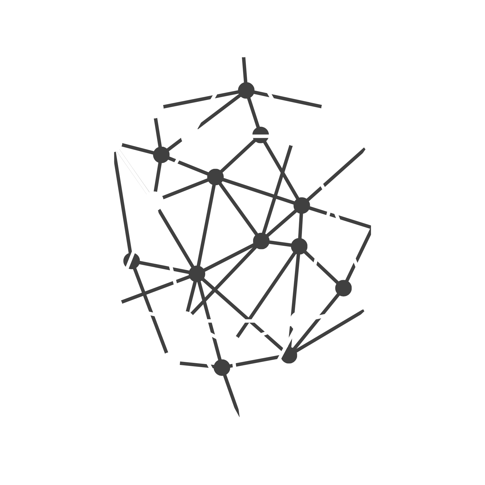

# Codite

  

**Codite** is a multi-language codebase visualizer designed to transform complex source code into beautiful, interactive, and comprehensible graphs. It helps developers quickly understand project architecture, dependencies, and code structure without having to manually read through thousands of lines of code.

---

## 🌟 Key Features

*   **Multi-Language Support (Local Scanning):** Analyzes C, C++, Rust, Go, TypeScript/JavaScript, and more.
*   **Relationship Mapping:** Automatically maps dependencies between Classes, Structs, Interfaces, Functions, and Imports/Includes.
*   **Obsidian-Style Interactive Graph:** A web-based, highly interactive 2D force-directed graph UI (built with D3.js/Canvas) providing smooth zooming, hovering highlights, and dynamic filtering.
*   **High Performance:** Powered by a Rust backend utilizing [Tree-sitter](https://tree-sitter.github.io/tree-sitter/) for lightning-fast, incremental code parsing.

## 🏗️ Architecture

The system is decoupled into two main components communicating via JSON:

### 1. Analyzer CLI (Backend)
- **Language:** Rust (focusing on concurrent file processing with Rayon/Tokio).
- **Core Engine:** Tree-sitter for robust incremental parsing using `.scm` queries.
- **Output:** Generates a structured JSON file containing `nodes` and `edges`.

### 2. Visualization UI (Frontend)
- **Framework:** React / Vite.
- **Rendering Engine:** D3.js / `react-force-graph` utilizing HTML5 Canvas for performance.
- **Aesthetic:** Designed to provide an intuitive, "Obsidian-like" feel with natural physics, color-coded directories, and interactive focus modes.

## 🚀 Getting Started

To run Codite locally, follow these steps:

### Prerequisites
- [Rust](https://www.rust-lang.org/tools/install) (latest stable)
- [Node.js](https://nodejs.org/) (v18 or higher) & npm

### 1. Generate Graph Data (Analyzer)
The analyzer scans your source code and generates the visualization data.
1. Navigate to the analyzer directory: `cd analyzer`
2. Configure the target directory in `Cargo.toml` under `[package.metadata.codite]`.
3. Run the scanner: `cargo run`

### 2. Run the Visualization (UI)
1. Navigate to the UI directory: `cd ui`
2. Install dependencies: `npm install`
3. Start the dev server: `npm run dev`
4. View the graph at [http://localhost:5173](http://localhost:5173).

## 🤝 Contributing

We welcome contributions! Please see our [CONTRIBUTING.md](CONTRIBUTING.md) for details on how to get started, our code of conduct, and our development process.

## 📄 License

This project is licensed under the **GNU General Public License v3.0** - see the [LICENSE](LICENSE) file for details.
